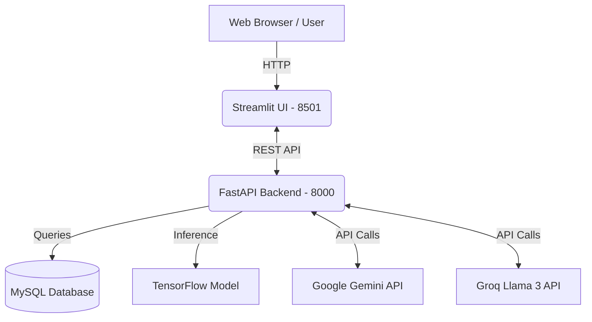

# AgriGuardAI - AI Powered Sustainable Crop Disease Detection and Decision Support System

<div align="center">
  

  [](https://python.org)
  [](https://fastapi.tiangolo.com)
  [](https://streamlit.io)
  [](https://www.docker.com/)
  [](https://tensorflow.org)
  [](https://opensource.org/licenses/MIT)
</div>

## 📌 Project Overview
**AgriGuardAI** is an intelligent, scalable, and cloud-ready decision support system designed for modern agriculture. It leverages Deep Learning to accurately identify plant diseases from images and uses advanced Generative AI (LLMs) to provide actionable treatment plans, crop rotation advice, and personalized farming insights. 

The project aims to empower farmers and agronomists with a reliable, instant AI assistant that operates robustly on the cloud through a Dockerized architecture.

## 🚀 Motivation
Crop diseases lead to substantial yield losses globally, threatening food security and farmers' livelihoods. Early detection often requires domain expertise which is scarce in remote areas. AgriGuardAI bridges this gap by providing an expert AI system directly to the user's device, combining the visual precision of Convolutional Neural Networks (CNNs) with the reasoning capabilities of Large Language Models (LLMs).

## ✨ Key Features
- **Tomato Disease Detection**: Highly accurate classification using a customized MobileNetV2 architecture.
- **Explainable AI (XAI)**: Generates Grad-CAM heatmaps so users can visualize exactly which parts of the leaf influenced the AI's prediction.
- **AI Advisor & Chatbot**: Interactive LLM integration (Gemini / Groq) for real-time agricultural advice and fallback mechanisms.
- **PDF Report Generation**: One-click downloadable diagnostic reports.
- **Analytics Dashboard**: View historical predictions and statistical insights.
- **REST API**: Fully decoupled backend using FastAPI, allowing integration with mobile or third-party apps.
- **Data Persistence**: MySQL database integration for tracking predictions securely.
- **Dockerized Architecture**: One-command setup using Docker and Docker Compose.

## 🛠 Technology Stack
| Category | Technologies |
|---|---|
| **Frontend** | Streamlit, Plotly, Pillow |
| **Backend** | FastAPI, Uvicorn, Python 3.11 |
| **Machine Learning** | TensorFlow, Keras (MobileNetV2), NumPy, Pandas, OpenCV (Headless) |
| **Database** | MySQL |
| **AI Integration** | Google Gemini (Primary), Groq Llama 3 (Fallback) |
| **DevOps & Deployment** | Docker, Docker Compose |

## 🏗 Architecture Diagram


## 📁 Project Folder Structure
```
AgriGuardAI/
├── api/                  # FastAPI Application
│   ├── routers/          # API Route Definitions
│   ├── schemas/          # Pydantic Models for Validation
│   └── main.py           # FastAPI Entry Point
├── assets/               # Static Files & Screenshots
├── database/             # Database Connection & Repositories
├── model/                # Pre-trained ML Models (.keras)
├── models/               # Domain Models
├── reports/              # Generated PDF Reports output directory
├── services/             # Core Business Logic & AI Integrations
├── streamlit/            # Streamlit Frontend UI Application
├── tests/                # Pytest Test Suite
├── utils/                # Helper Scripts (GradCAM, PDF generation, etc.)
├── .env.example          # Example Environment Variables
├── docker-compose.yml    # Docker Compose Configuration
├── Dockerfile            # Multi-stage Docker Image build instructions
├── requirements.txt      # Python Dependencies
└── README.md             # Project Documentation
```

## 🧠 Machine Learning Pipeline
1. **Input Validation**: Images are pre-processed to detect whether they contain a leaf using rule-based validation.
2. **Inference**: A MobileNetV2 CNN (fine-tuned on plant disease datasets) runs inference to classify the disease.
3. **Grad-CAM**: The gradient signals are propagated backward to the last convolutional layer to highlight the "diseased" regions, ensuring the AI's decision is interpretable.

## 📡 REST API Documentation
The backend exposes a fully documented RESTful API. Once running, you can access the interactive Swagger UI at:
👉 `http://localhost:8000/docs`

**Core Endpoints:**
- `GET /health` : System health status (DB + AI connection checks)
- `POST /predict/` : Submit an image for disease classification.
- `GET /history/` : Retrieve past diagnostic records.
- `POST /advisor/chat/` : Send a message to the AI chatbot.

## 🐳 Docker Architecture
The application uses Docker Compose to orchestrate three core services on a unified custom bridge network (`agriguard_net`):
1. **`mysql`**: A persistent MySQL 8 database container.
2. **`api`**: The FastAPI application handling all backend processing.
3. **`streamlit`**: The user-facing web interface.

Environment variables and secrets are passed securely using a `.env` file without being hardcoded into the images.

## ⚙️ Installation Instructions

### Option 1: Installation with Docker (Recommended)
You only need Docker and Docker Compose installed.

1. Clone the repository:
   ```bash
   git clone https://github.com/yashbera123/AgriGuardAI.git
   cd AgriGuardAI
   ```
2. Configure environment variables:
   ```bash
   cp .env.example .env
   # Edit .env with your database credentials and API keys
   ```
3. Start the application:
   ```bash
   docker compose up -d --build
   ```
4. Access the apps:
   - **Streamlit**: `http://localhost:8501`
   - **FastAPI Docs**: `http://localhost:8000/docs`

### Option 2: Installation without Docker (Local Setup)
Ensure you have Python 3.11+ and MySQL installed.

1. Clone the repository and navigate into it.
2. Create and activate a virtual environment:
   ```bash
   python -m venv venv
   source venv/bin/activate  # On Windows: venv\Scripts\activate
   ```
3. Install dependencies:
   ```bash
   pip install -r requirements.txt
   ```
4. Set up the database:
   - Create a MySQL database named `agriguard`.
   - Update `.env` with your local MySQL credentials (`DB_HOST=localhost`).
5. Run the FastAPI server:
   ```bash
   uvicorn api.main:app --reload --host 0.0.0.0 --port 8000
   ```
6. Open a new terminal and run the Streamlit app:
   ```bash
   PYTHONPATH=. streamlit run streamlit/app.py
   ```

## 📸 Screenshots
*(Coming soon)*

## 🔮 Future Improvements
- Migration to a cloud database (AWS RDS / Supabase).
- CI/CD Pipelines with GitHub Actions for automated testing and Docker image pushes.
- Support for multiple languages (localization) in the AI advisor.
- Adding real-time weather integration for holistic farming advice.

## 👨‍💻 Developer
Developed as a comprehensive final-year AI and Full Stack Engineering project.
If you find this project helpful, consider leaving a ⭐ on the repository!

## 📄 License
This project is licensed under the MIT License. See the LICENSE file for details.
